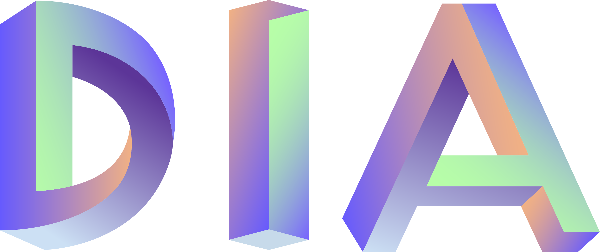

# Readme

## DIA: Technical Introduction

Welcome to the [DIAdata.org](https://diadata.org/) platform. DIA is an ecosystem for open financial data in a financial smart contract ecosystem. The target of DIA is to bring together data analysts, data providers and data users. In general, DIA provides a reliable and verifiable bridge between off-chain data from various sources and on-chain smart contracts that can be used to build a variety of financial dApps.

#### Crowd-, and open-sourced Financial Data

All DIA data points can be used in Ethereum Smart Contracts. We provide oracle solutions to use this financial information in any smart contract. The correctness of oracle data can always be verified by monitoring our off-chain real-time API and the data published in the oracle.

### Alpha Version - dApp Registry

[SIX/F10 PSD II Sandbox](https://f10-sandbox-portal.apps.ndgit.com/#/apis) - PSD II and pricing data for FinTechs 

[Open-Source Calculation Agent](https://blockstate.com/decentral-calculation-agent/)

[Swiss ISIN note using DIA data](https://en.bitcoinwiki.org/wiki/Index_Fund) 

[CoinHub](http://coinhub.diadata.org) - A transparent, open-source alternative to CMC

[Neufund](https://blog.neufund.org/neufund-1-1-is-live-on-mainnet-db35d77b2ef2) 

[Helena/Consensys](https://helena.network) - Delivering real-time blockchain fundamental insights

### How to contribute

DIA is open for anyone to contribute and we always welcome pull requests. We also provide tasks on [Gitcoin](https://gitcoin.co/), a collaboration tool focused on cryptocurrency projects.

