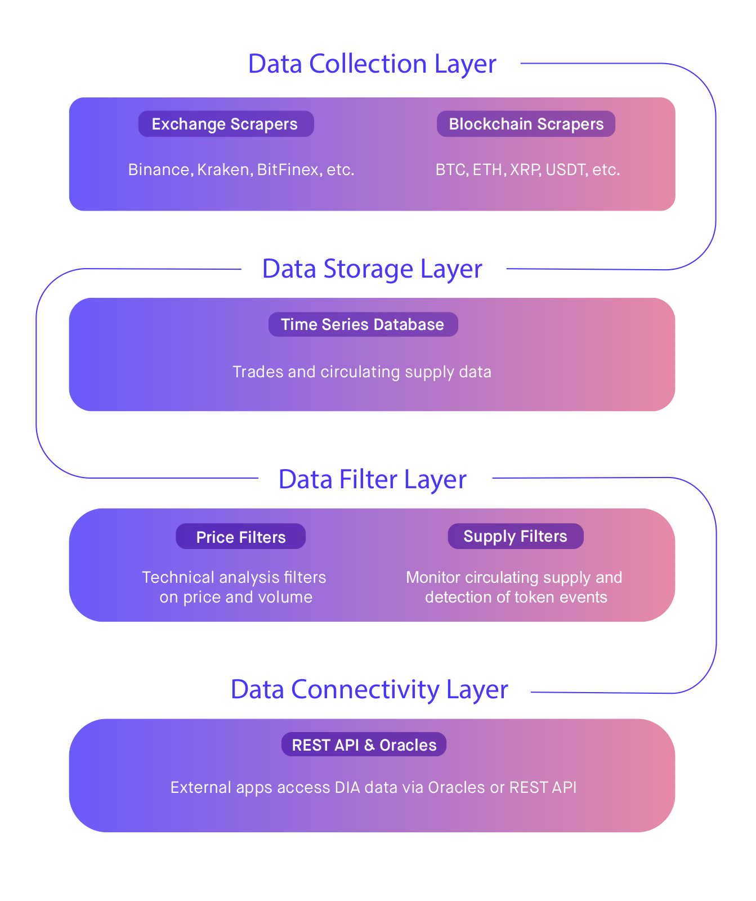

# DIA: Technical Introduction 
Welcome to the [DIAdata.org](https://diadata.org/) platform.
DIA is an ecosystem for open financial data in a financial smart contract ecosystem.
The target of DIA is to bring together data analysts, data providers and data users.
In general, DIA provides a reliable and verifiable bridge between off-chain data from various sources and on-chain smart contracts that can be used to build a variety of financial dApps.

### Decentralized Financial Data
All DIA data points can be used in Ethereum Smart Contracts.
We provide oracle solutions to use this financial information in any smart contract.
The correctness of oracle data can always be verified by monitoring our off-chain real-time API and the data published in the oracle.

## Methodology Documentation
Currently, DIA collects several classes of data.
Separate documentation exists for each of these different use cases.

* [Exchange Scrapers](documentation/methodology/ExchangePrices.md) are the components that get trade data from various exchanges and use these trades to construct average prices.
* [Supply Scrapers](documentation/methodology/SupplyNumbers.md) are used to determine circulating supply numbers for cryptocurrency assets.
* [Oracles](documentation/methodology/Oracles.md) show how our oracles can be accessed.
This information varies for each currency and is highly specific.

## Coinhub Oracles

The Coinhub oracles are located in a [single smart contract](https://ropsten.etherscan.io/address/0x37caf6d76ff56d05a7f21a14e9e6eed86726e4de).
This smart contract holds mappings from an index to an asset's name, its price, and supply data.
By using `getParameters(asset_index)` it is possible to retrieve this data.
Along with the actual data there is a metadata field for the timestamp of the last update.

Updates are supplied by the DIA Oracle service that periodically supplies updates into the smart contract.
In the event view, the latest updates can be seen.
The event fields show the values in the following locations:

* Price in Cent is in the second field (display as `number`)
* Supply is in the third field (display as `number`)
* UNIX Timestamp of last update is displayed in the fourth field (display as `number`)
* Name is displayed in the sixth and last field (display as `text`).

## API Access
You can find documnentation for our [live API](https://api.diadata.org/v1) on our [swagger site](https://api.diadata.org/swagger/index.html).
Several endpoints exist that show the different kind of data we collect:

When referencing currencies, `{TLA}` has to be replaced by the acronym for an asset (e.g., BTC for Bitcoin).
* Quotations for prices (SMA120) can be found at endpoint [https://api.diadata.org/v1/symbol/BTC](https://api.diadata.org/v1/symbol/BTC).
* Supply data for crypto assets is located at [https://api.diadata.org/v1/supply/BTC](https://api.diadata.org/v1/supply/BTC)

Currently, DIA collects data from several crypto exchanges.
To get an overview, the latest information about these exchanges can be found in this table:

Name | Number of Pairs | API link
--- | --- | ---
Binance | [47](config/Binance.json) | [Binance API Documentation](https://github.com/binance-exchange/binance-official-api-docs)
Bitfinex | [25](config/Bitfinex.json) | [Bitfinex Websocket Documentation](https://docs.bitfinex.com/docs/ws-general)
Coinbase | [3](config/CoinBase.json) | [Coinbase v2 API](https://developers.coinbase.com/api/v2)
GateIO | [42](config/GateIO.json) | [Gate.io API Documentation](https://www.gate.io/api2)
HitBTC | [43](config/HitBTC.json) | [HitBTC API Browser](https://api.hitbtc.com/api/2/explore/)
Huobi | [40](config/Huobi.json) | [Huobi API Documentation](https://github.com/huobiapi/API_Docs_en/wiki/Huobi.pro-API)
Kraken | [8](config/Kraken.json) | [Kraken Public API Documentation](https://www.kraken.com/help/api#public-market-data)
LBank | [20](config/LBank.json) | [LBank API Documentation (Chinese)](https://github.com/LBank-exchange/lbank-official-api-docs)
OKEx | [27](config/OKEx.json) | [OKEx API Documentation (Chinese)](https://github.com/okcoin-okex/API-docs-OKEx.com)
Simex | [14](config/Simex.json) | [Simex API Documentation](https://simex.global/en/docs/introduction)
ZB.com | [127](config/ZB.json) | [Zb.com API Documentation (Chinese)](https://www.zb.com/i/developer)

Here you can find the introduction to the structure of the system and first steps to contribute.

## DIA Technical Structure
DIA is setup as a hybrid system with off-chain components for storing and proceccing large amounts of data and on-chain components providing data sources for financial smart contracts.
Currently, Ethereum is used as smart contract plaform because of its widespread use and technical quality, but the DIA system is not limited to one blockchain technology.

### Centralized Backend
For collecting financial data, we use a centralized backend that runs collectors for all kinds of financial data.
All collected data is processed by a database setup consisting of a stream-oriented kafka instance and a key-value store for faster access of certain intermediate results.
These collectors are separated in different classes:

* Exchange Scrapers: These collect data from exchanges for cryptocurrencies and other assets (like stocks, futures, and rare earth metals).
Every exchange scraper is run independently and is structured around the idea of `pairs` that are used to indicate the pair of assets that is used in a trade.
For example, a trade from Bitcoin to US-Dollar is stored under `BTCUSD`.
* Blockchain Scrapers: These scrapers are used to determine attributes of blockchains. The most prominent attribute is the circulating supply of a cryptocurrency, for which various scrapers already exist.
Depending on the expected update rate of a blockchain, these scrapers update the backend periodically about their data.
Blockchain scrapers are run as docker containers that can be managed independently.
Often, these collect Gigabytes of data over time (they are dealing with ever-growing blockchains) and thus should be managed in a separate way not directly baked in the database executable.
* Quotation Scrapers: They are used to collect official quotations from central trusted providers.
The first quotations in our database are daily exchange rates from the European Central Bank (ECB) against various international currencies.

## How to contribute
DIA is open for anyone to contribute and we always welcome pull requests.
We also provide tasks on [Gitcoin](https://gitcoin.co/), a collaboration tool focused on cryptocurrency projects.

